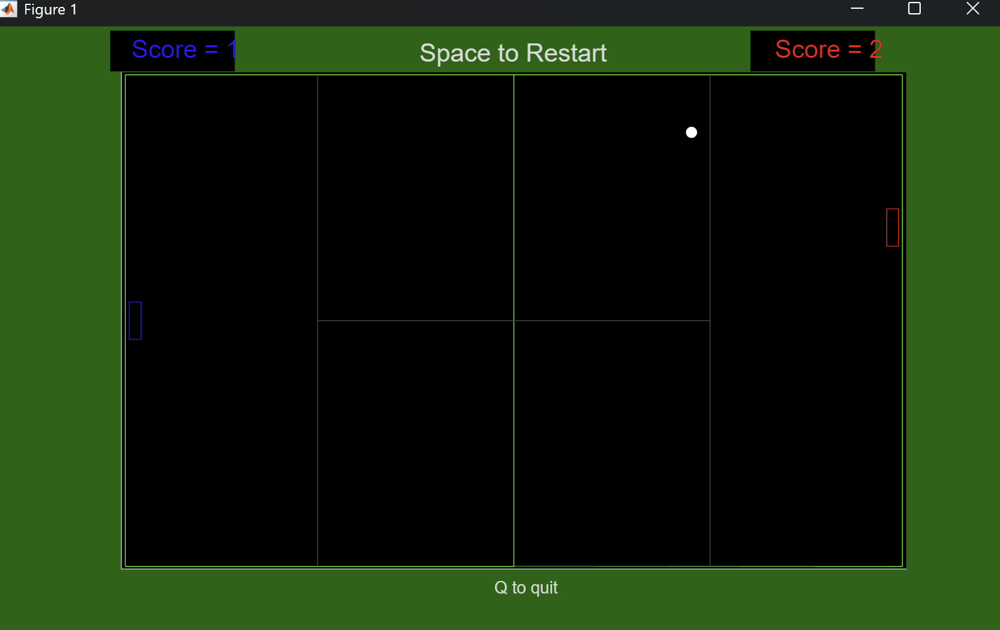

# MATLAB Pong

A two-player implementation of Pong developed from scratch in MATLAB.

## Demo

## Features

- Two-player keyboard controls
- Real-time graphical rendering
- Randomised initial ball trajectory
- Ball collision with paddles and boundaries
- Impact-dependent changes to ball trajectory
- Progressive ball-speed increase after successful returns
- Live score tracking and game restart
- Configurable key bindings and game parameters

## How to Run

1. Place all files in the same MATLAB directory.
2. Open main.m in MATLAB.
3. Run main
4. Press `Space` to start the game.
5. Press `H` to view the controls.
6. Press `Q` to quit.

## Project Structure 

- main.m — main game logic, rendering, keyboard controls, scoring and collision handling
- drawshape.m — plots coordinate-defined shapes
- reflectShape.m — reflects coordinate matrices about the x- or y-axis
- colourChange.m — controls colour changes on the start screen

## Other Features

The game represents the ball using position and velocity vectors that are updated during the game loop. Boundary collisions reverse the relevant velocity component, while paddle collisions modify the ball's direction and speed according to the impact position.

Keyboard call-backs control paddle movement while restricting the paddles to the playing area.
